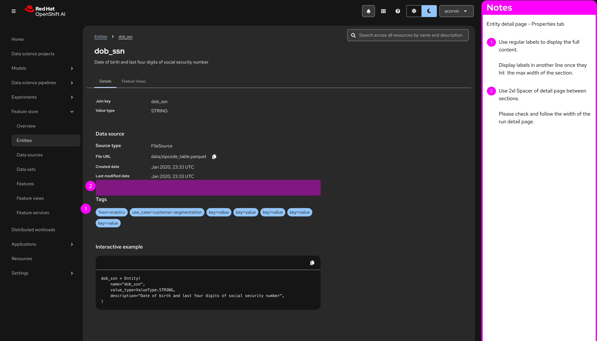

# Visual Specifications

> **⚠️ REMINDER:** Ignore pink color annotations in images and right side drawers. Focus on standard UI components.

## 1. Entities - List View

* **Context:** The main entry point for the Entities nav.

## 2. Entities - Detail Page (Parent Layout)
* **Context:** This is the shell for the specific Entity (e.g., "Customer").
* **Components:** Breadcrumbs, Page Header, and the **Tabs Component** itself.

### 2.1 Tab A: "Details" Active

* **Goal:** Show metadata (Join key, Value type, Data source with source type, file URL, Created Date and Last modefied data, tags,and Code snippet for the entity ).
* **Component:** Use PatternFly `DescriptionList`.

### 2.2 Tab B: "Feature Views" Active

* **Goal:** List all Feature Views associated with this Entity.
* **Component:** Use PatternFly `Table` (Compact).