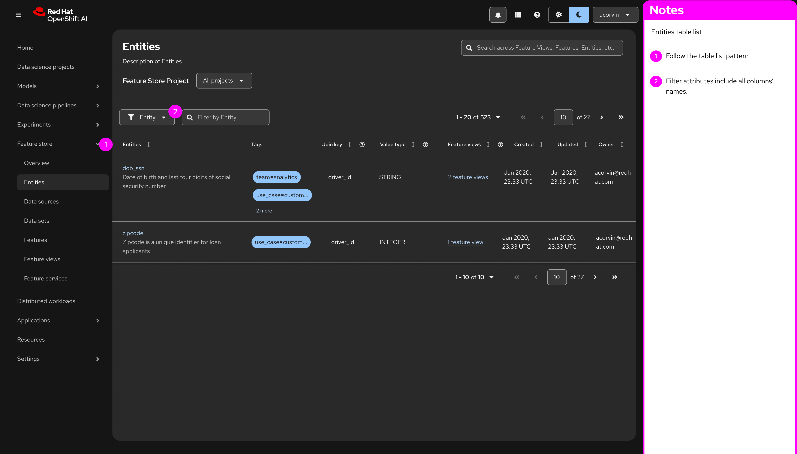
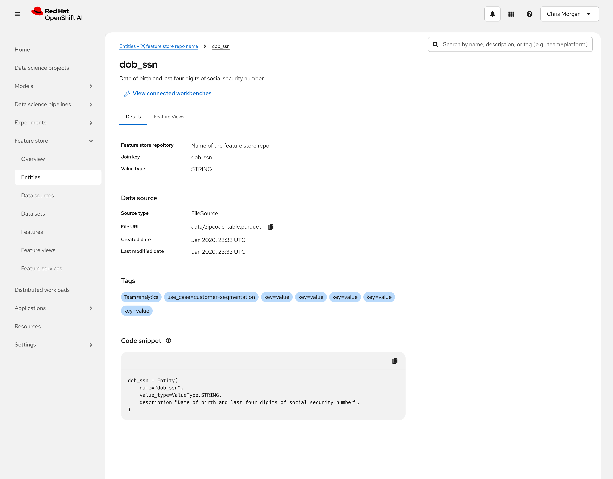
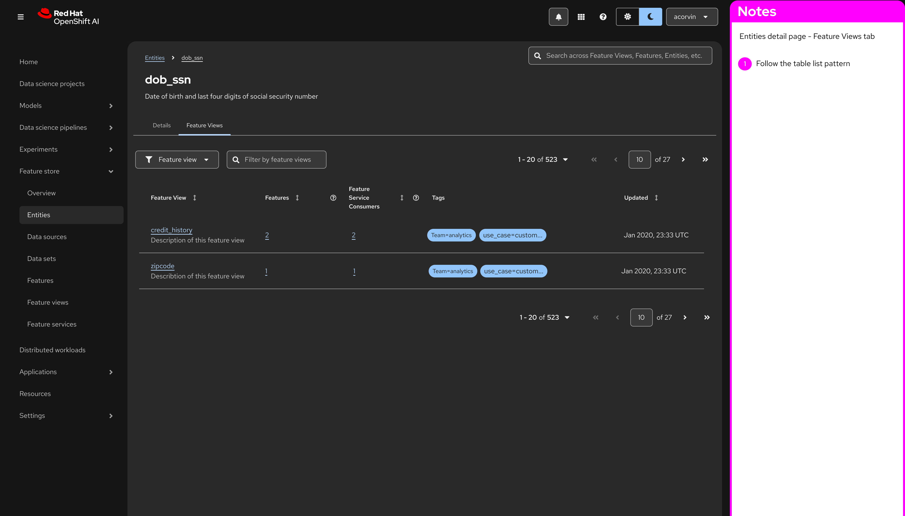

# Visual Specifications

> **⚠️ REMINDER:** Ignore pink color annotations in images and right side drawers. Focus on standard UI components.

## 1. Entities - List View

* **Context:** The main entry point for the Entities nav.

## 2. Entities - Detail Page (Parent Layout)
* **Context:** This is the shell for the specific Entity (e.g., "Customer").
* **Components:** Breadcrumbs, Page Header, and the **Tabs Component** itself.

### 2.1 Tab A: "Details" Active

* **Goal:** Show metadata (Join key, Value type, Data source with source type, file URL, Created Date and Last modefied data, tags,and Code snippet for the entity ).
* **Component:** Use PatternFly `DescriptionList`.

### 2.2 Tab B: "Feature Views" Active

* **Goal:** List all Feature Views associated with this Entity.
* **Component:** Use PatternFly `Table` (Compact).

## 2. Entity Detail Page
**Context:** This page renders when a user clicks a row in the Entities List.
**Route:** `/feature-store/entities/:id`

### 2.1 Tab A: Details (Metadata)

**Layout Requirement:** PatternFly `DescriptionList` (Horizontal).
**Required Fields to Display:**
1.  **Description:** (Long text)
2.  **Join Key:** (e.g., `customer_id`)
3.  **Value Type:** (e.g., `INT64`)
4.  **Data Source:** Text + Type (e.g., "Snowflake Table").
5.  **File URL:** A clickable link or path.
6.  **Tags:** A `LabelGroup`.
7.  **Code Snippet:** A read-only `CodeEditor` showing how to retrieve this entity.

### 2.2 Tab B: Feature Views

**Layout Requirement:** PatternFly `Table` (Compact).
**Columns:** Name, Feature Service, Last Updated, Status.