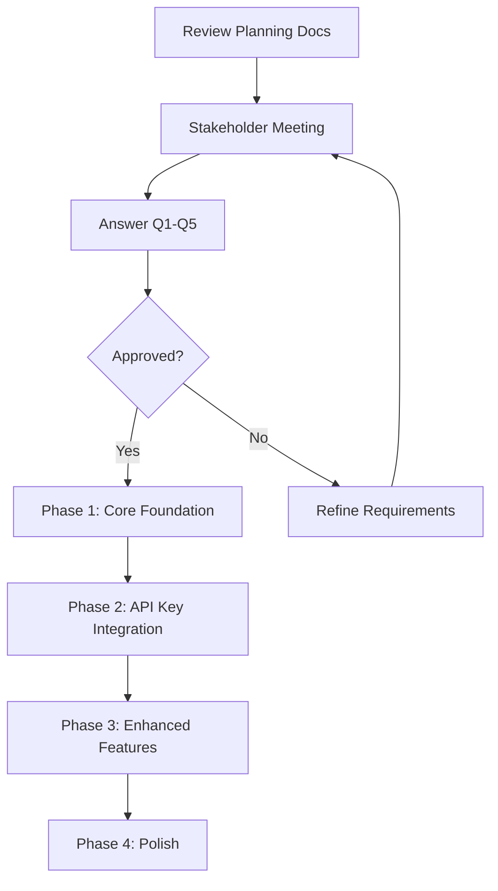

# MaaS Admin UI Feature Planning - November 12, 2025

This directory contains comprehensive planning documents for aligning the RHOAI prototype with the Feature Refinement document for RHOAISTRAT-638 (MaaS Admin UI).

## Quick Links

| Document | Purpose | Audience | Read Time |
|----------|---------|----------|-----------|
| [✅ Decisions](DECISIONS.md) | **All stakeholder decisions made** | All stakeholders | **5 min** |
| [📊 Executive Summary](executive-summary.md) | High-level overview and recommendation | Leadership, PMs | 5 min |
| [❓ Stakeholder Questions](stakeholder-questions.md) | Questions with decisions marked | All stakeholders | 10 min |
| [📈 Comparison Matrix](comparison-matrix.md) | Current vs target state comparison | UX, Engineering | 15 min |
| [🔍 Feature Analysis](feature-analysis.md) | Deep requirements analysis | UX, PMs | 20 min |
| [🛠️ Implementation Plan](implementation-plan.md) | Detailed development plan (UPDATED) | Engineering, UX | 30 min |

## What's in This Package

### Planning Context

**Source:** [Feature Refinement - RHOAISTRAT-638 - MaaS Admin UI](https://docs.google.com/document/d/1ApBP2VcMUELEY0lIx6M5761oHmjEdpKwvMpivIUZD7A/edit?tab=t.3mrf1syv46a)  
**Meeting:** November 12, 2025 MaaS Refinement  
**Recording:** [Available in design-history.md](../design-history.md)

### Key Findings

1. **Major Conceptual Shift:** From generic "Policies" to MaaS-specific "Tiers"
2. **Simplified Model:** Group-based tier assignment instead of complex multi-target policies
3. **Inheritance Model:** API keys automatically inherit from user's tier(s)
4. **MaaS Focus:** Only MaaS-tagged models, no MCP in MVP
5. **Gap Score:** 42% major gaps, but solid foundation exists

### Recommendation

✅ **Proceed with incremental 4-phase implementation (6 weeks)**

## How to Use These Documents

### For Leadership / PMs
Start here:
1. **Read [DECISIONS.md](DECISIONS.md) first** - All questions answered! ✅
2. Review [Executive Summary](executive-summary.md) for context
3. Approve the decisions and proceed with implementation

### For UX Designers
Start here:
1. Read [Feature Analysis](feature-analysis.md) for requirements
2. Review [Comparison Matrix](comparison-matrix.md) for gaps
3. Check [Implementation Plan](implementation-plan.md) for design details
4. Help answer UX-related questions

### For Engineers
Start here:
1. **Read [DECISIONS.md](DECISIONS.md)** - All decisions documented ✅
2. Review [Implementation Plan](implementation-plan.md) for detailed technical approach (UPDATED with decisions)
3. Estimate effort for each phase
4. Identify backend API dependencies
5. **Begin Phase 1 immediately** - All questions answered!

## Critical Path

## ✅ All Decisions Made!

**All critical questions have been answered.** See [DECISIONS.md](DECISIONS.md) for complete list.

**Key Decisions:**
1. **Policies vs Tiers:** Keep both - add Tiers, keep Policies with warning
2. **MaaS Tagging:** Already implemented (AI Assets)
3. **Multiple Tiers:** Level-based priority (higher number = higher tier)
4. **Service Accounts:** Groups only
5. **Tier Deletion:** Keys become disassociated

Implementation can begin immediately!

## Timeline

| Phase | Duration | Deliverable |
|-------|----------|-------------|
| **Decision** | 1 week | Stakeholder answers to Q1-Q5 |
| **Phase 1** | 2 weeks | Core Tier concept + MaaS tagging |
| **Phase 2** | 2 weeks | API Key tier inheritance |
| **Phase 3** | 1 week | Enhanced features |
| **Phase 4** | 1 week | Polish and nice-to-haves |
| **Total** | 6 weeks | Full MVP implementation |

## Success Criteria

- [x] All critical questions (Q1-Q5) answered ✅
- [x] Decisions documented in DECISIONS.md ✅
- [x] Implementation plan updated ✅
- [ ] Backend API dependencies confirmed
- [ ] User testing plan created
- [ ] Communication plan drafted
- [ ] Phase 1 implementation started

## Related Documents

- [Design History](../design-history.md) - Meeting notes and context
- [Design Spec](../design-spec.md) - Original design specification
- [Design Tasks](../design-tasks.md) - Task tracking
- [Context Sources](../context-sources.md) - Reference links

## Contact

**Questions about this planning:**
- UXD: Andy Braren
- Product: Jenny Yi, Jonathan Zarecki
- Engineering: Andrew Ballantyne

**Slack:**
- #wg-maas-internal
- #maas-update

**Jira:**
- [RHOAISTRAT-638](https://issues.redhat.com/browse/RHOAISTRAT-638) - MaaS UI for Admin
- [RHAISTRAT-173](https://issues.redhat.com/browse/RHAISTRAT-173) - API Keys

---

## Document Versions

| Date | Author | Changes |
|------|--------|---------|
| 2025-11-12 | Andy Braren | Initial planning documents created |

---

**Last Updated:** November 12, 2025  
**Status:** 🟢 **Ready for Implementation** - All decisions made!

